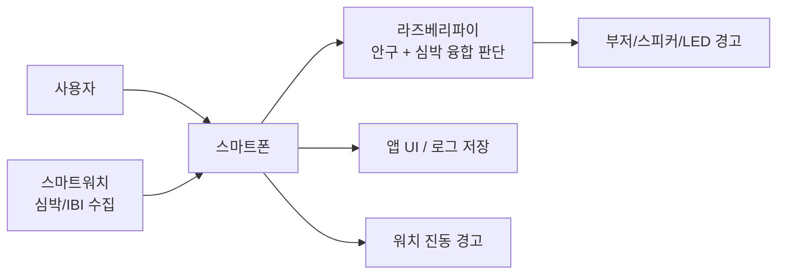
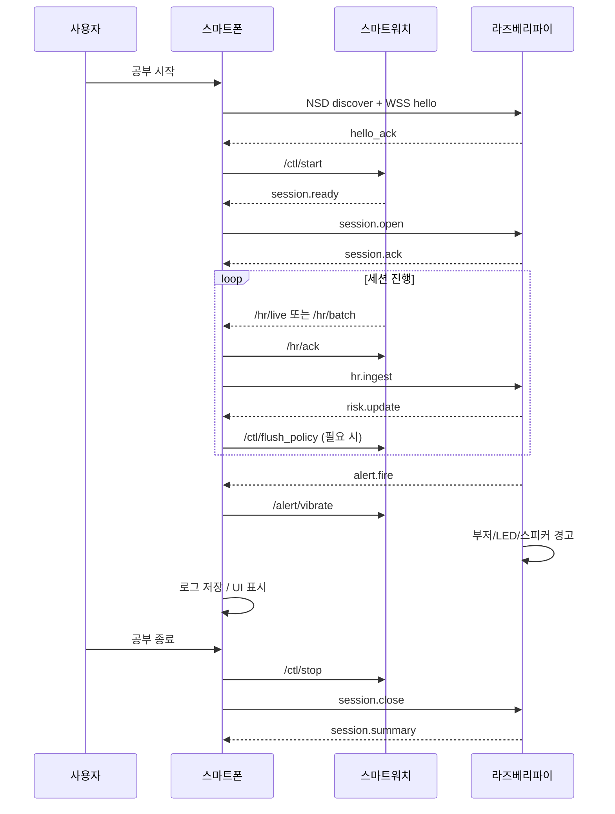
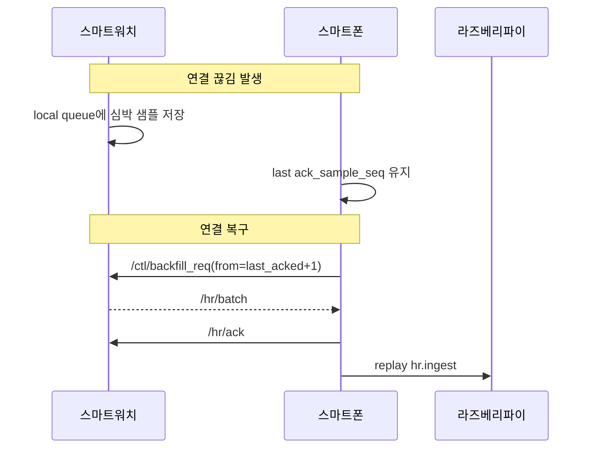
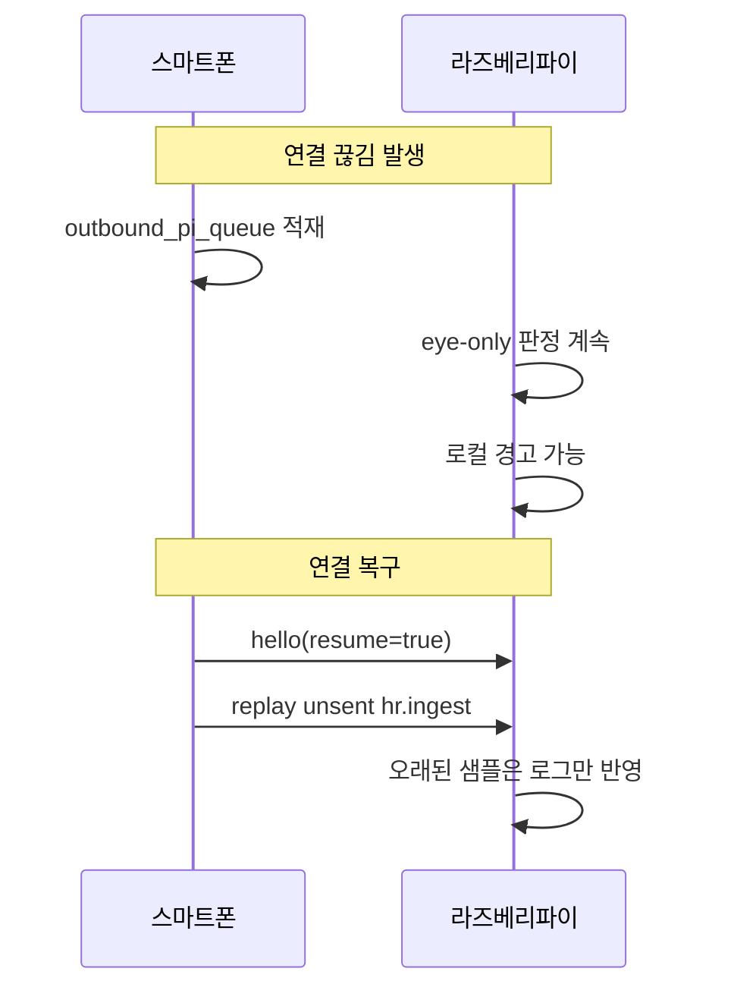
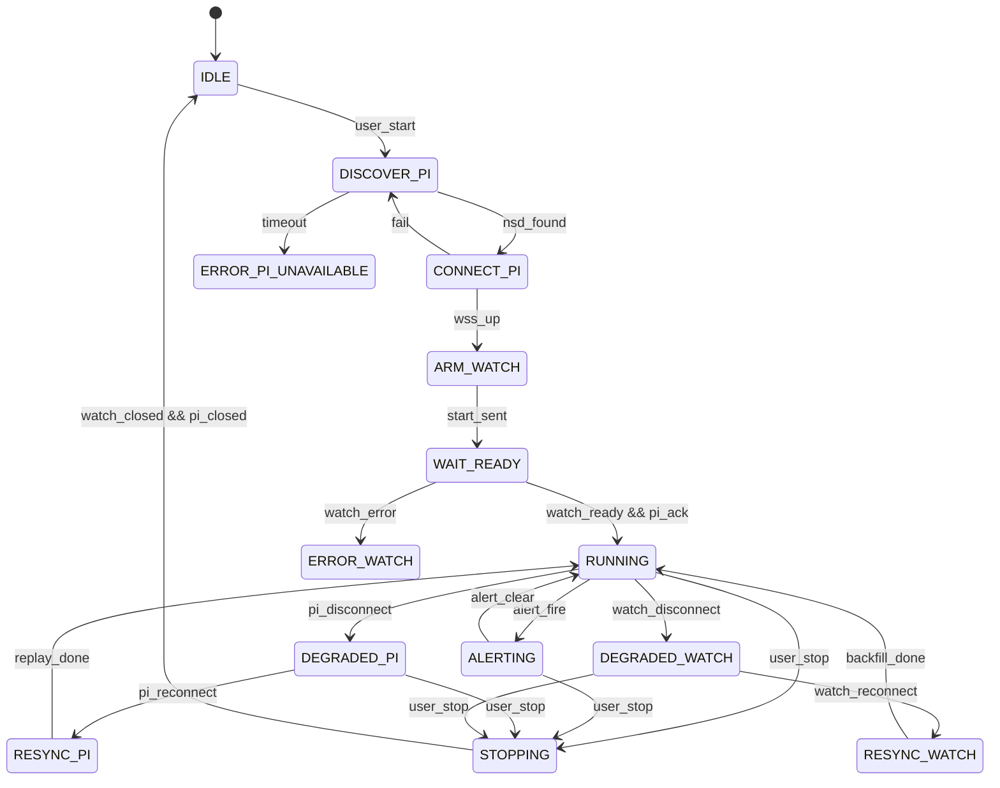
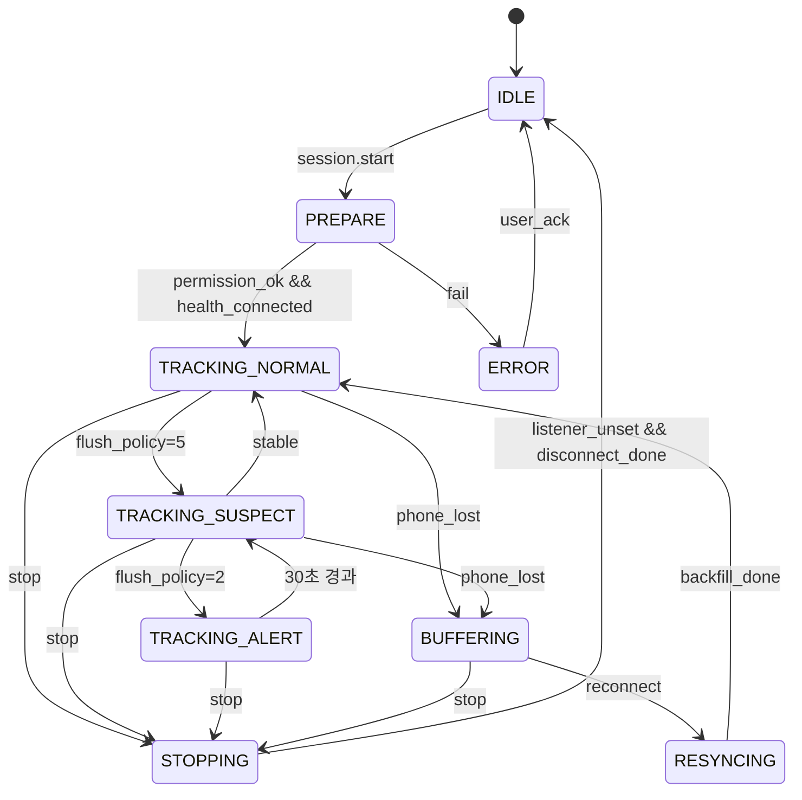
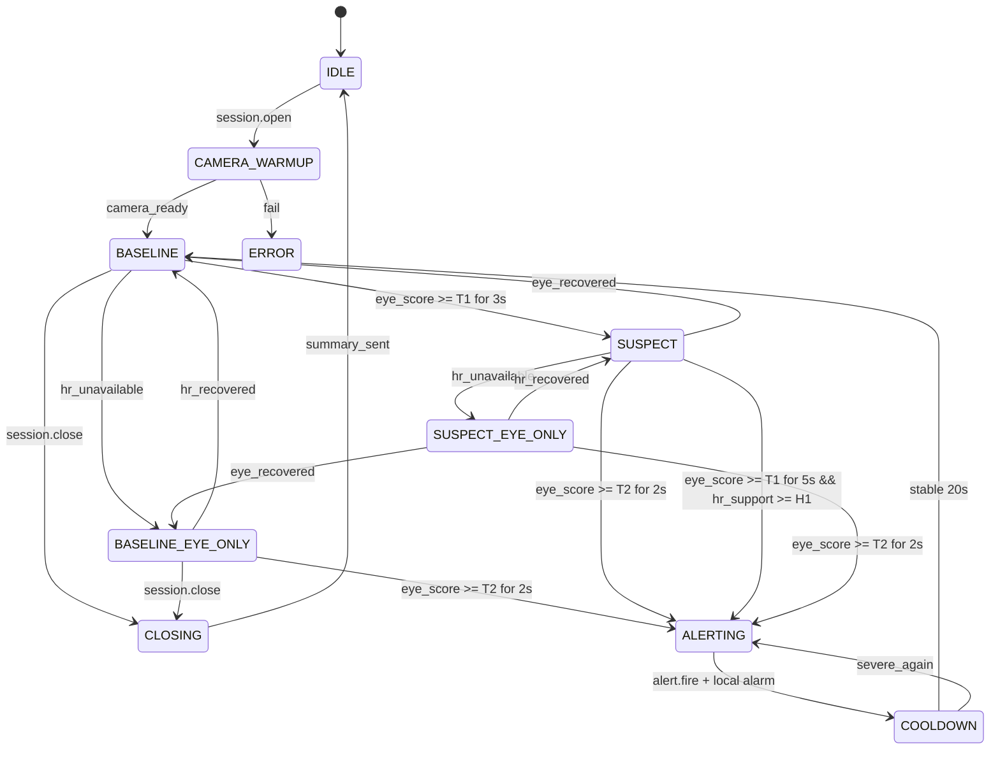

# Sleep Care 통신 및 판단 아키텍처 최종 설계

## 1. 문서 목적

이 문서는 지금까지 논의한 내용을 바탕으로, **갤럭시 워치 기반 심박수 데이터**와 **라즈베리파이 카메라 기반 안구 데이터**를 이용한 졸음 감지 시스템의 **최종 연결 구조**, **졸음 판단 주체**, **실제 통신 프로토콜**, **메시지 흐름도**, **상태 머신**을 구현 가능한 수준으로 정리한 문서이다.
장기 수면 분석과 추천 정책은 `plan.md` 및 `plan-data-and-recommendation.md`를 기준으로 본다.

## 1.1 현재 앱 구현 기준

현재 Android 앱에 반영된 범위는 아래와 같다.

- 모바일 앱 ↔ 라즈베리파이: 구현됨
  - 로컬 네트워크 `NSD + WSS`
  - `hello`, `hello_ack`, `session.open`, `session.ack`, `risk.update`, `alert.fire`, `session.close`, `session.summary`, `ping/pong`
- 워치 앱 ↔ 모바일 앱: 미구현
  - `hr.ingest`, 워치 ACK/백필, 워치 진동 요청은 아직 사용하지 않음
- 현재 세션 모드: `eye-only`
- 수면 데이터 연동: 미구현

따라서 이 문서는 장기 목표 구조를 유지하되, 실제 앱 구현은 먼저 **폰 ↔ 파이 직결 구조**를 기준으로 진행 중이라고 본다.

---

## 2. 최종 결론

### 2.1 권장 연결 구조

장기 목표 구조는 **스마트워치 → 스마트폰 → 라즈베리파이** 이다.

현재 구현은 워치 없는 **스마트폰 → 라즈베리파이** `eye-only` 구조다.

- **워치 ↔ 폰**: Wear OS Data Layer 기반 통신
- **폰 ↔ 라즈베리파이**: 로컬 네트워크 기반 서비스 발견 + WebSocket 통신

### 2.2 최종 졸음 판단 주체

**라즈베리파이**를 최종 졸음 판단 주체로 둔다.

### 2.3 판단 신호 우선순위

- **주 신호**: 안구 데이터
- **보조 신호**: 심박수 / IBI 데이터

즉, 라즈베리파이는 카메라 기반 눈 감김 판별 결과를 중심으로 판단하고, 심박 데이터는 오탐 감소 및 위험도 보정에 사용한다.

---

## 3. 왜 이 구조가 최선인가

### 3.1 워치 → 폰 → 파이가 더 나은 이유

워치는 기본적으로 폰과의 연동이 가장 자연스럽고 안정적이다. 반면 워치가 라즈베리파이와 직접 연결되는 구조는 구현 난이도와 유지보수 부담이 크다.

따라서 다음과 같은 역할 분리가 가장 효율적이다.

- **워치**: 심박 센서 노드
- **폰**: 세션 제어, 중계, 기록
- **라즈베리파이**: 안구 데이터 처리 및 최종 졸음 판단

### 3.2 라즈베리파이가 최종 판단 주체여야 하는 이유

라즈베리파이는 이미 카메라 기반 안구 데이터를 직접 생성한다. 따라서 심박 데이터를 폰에서 다시 파이로 보내거나, 반대로 안구 결과를 다시 폰으로 보내서 폰이 최종 판단하는 구조는 비효율적이다.

가장 자연스러운 데이터 융합 위치는 **안구 데이터가 이미 존재하는 라즈베리파이**이다.

---

## 4. 기기별 역할 정의

### 4.1 스마트워치

#### 역할
- 심박수 및 IBI 수집
- 심박 샘플 임시 버퍼링
- 폰으로 실시간/배치 데이터 전송
- 연결 끊김 시 약한 백업 진동 경고

#### 비권장 역할
- 최종 졸음 판단
- 장시간 복잡 연산
- 카메라 기반 안구 데이터 융합

### 4.2 스마트폰

#### 역할
- 공부 시작 / 종료 제어
- 세션 ID 생성 및 관리
- 라즈베리파이와의 연결 관리
- 현재 구현에서는 Pi 위험도/알림 수신 및 로컬 저장
- 향후 워치 심박 데이터 수신 및 라즈베리파이 중계
- 사용자 설정, 기록, UI 표시
- 경고 로그 저장

#### 비권장 역할
- 최종 졸음 판단 주체

### 4.3 라즈베리파이

#### 역할
- 카메라 기반 눈 감김 판별
- 현재 구현에서는 eye-only 기반 위험도 계산
- 향후 심박 데이터 수신
- 향후 안구 + 심박 데이터 융합
- 최종 위험도 계산
- 경고 출력(부저/스피커/LED/화면)

---

## 5. 전체 시스템 개요



---

## 6. 물리/논리 통신 구조

### 6.1 워치 ↔ 폰

#### 채택 기술
- **Samsung Health Sensor SDK**
- **Wear OS Data Layer API**
  - `MessageClient`
  - `DataClient`
  - `ChannelClient`

#### 용도 분리
- **MessageClient**: 실시간 제어 메시지, 짧은 심박 이벤트, 경고 전달
- **DataClient**: 지속 상태 동기화, 현재 세션 상태 공유
- **ChannelClient**: 세션 종료 후 대용량 백필 또는 덤프 전송

### 6.2 폰 ↔ 라즈베리파이

#### 채택 기술
- **와이파이 로컬 네트워크**
- **NSD / DNS-SD**: 파이 서비스 자동 발견
- **WSS(WebSocket over TLS)**: 양방향 실시간 통신

#### 역할 분리
- **폰**: WebSocket client
- **라즈베리파이**: WebSocket server

---

## 7. 심박 전송 정책

워치의 심박 측정은 연속 측정으로 가정하되, 실제 전달은 배터리와 화면 꺼짐 상황을 고려해 **적응형 flush 정책**을 사용한다.

### 7.1 flush 정책

| 모드 | 워치 flush 주기 | 설명 |
|---|---:|---|
| NORMAL | 15초 | 평상시 |
| SUSPECT | 5초 | 안구 위험도 상승 시 |
| ALERT_NEAR | 2초 | 경고 직전 고정밀 모드 |
| RECOVERY | 15초 | 안정화 후 복귀 |

### 7.2 설계 의도

- 평소에는 배터리 소모를 줄인다.
- 안구 기반 위험도가 올라갈 때만 심박 freshness를 높인다.
- 심박은 주 신호가 아니라 **보조 신호**이므로 필요 시에만 더 촘촘히 가져온다.

---

## 8. 세션 모델

#### 가정
- 한 번에 세션은 1개만 활성화
- 워치 1대, 폰 1대, 파이 1대
- 원본 카메라 프레임은 라즈베리파이 밖으로 전송하지 않음
- 세션 ID는 폰이 생성

#### 세션 라이프사이클
1. 사용자가 폰에서 공부 시작
2. 폰이 워치와 파이를 모두 활성화
3. 워치가 심박을 수집해 폰으로 전송
4. 폰이 심박을 파이로 중계
5. 파이가 안구 + 심박을 융합해 졸음 판단
6. 졸음이면 파이가 경고, 폰은 기록, 워치는 진동 보조 경고
7. 사용자가 폰에서 공부 종료
8. 세션 요약 저장

---

## 9. 프로토콜 공통 envelope

모든 메시지는 다음 JSON 구조를 기본으로 사용한다.

```json
{
  "v": 1,
  "t": "event.type",
  "sid": "01HTY8M4Q4M0Q9P7J9W9K8Z1AB",
  "seq": 184,
  "src": "watch|phone|pi",
  "sent_at_ms": 1775578105123,
  "ack_required": true,
  "body": {}
}
```

#### 필드 설명

| 필드 | 의미 |
|---|---|
| `v` | 프로토콜 버전 |
| `t` | 이벤트 타입 |
| `sid` | 세션 ID |
| `seq` | 링크별 단조 증가 시퀀스 |
| `src` | 발신자 (`watch`, `phone`, `pi`) |
| `sent_at_ms` | 발신 시각(ms) |
| `ack_required` | ACK 필요 여부 |
| `body` | 실제 페이로드 |

---

## 10. 워치 ↔ 폰 메시지 경로 정의

### 10.1 MessageClient path

```text
/sc/v1/ctl/start
/sc/v1/ctl/stop
/sc/v1/ctl/flush_policy
/sc/v1/hr/live
/sc/v1/hr/batch
/sc/v1/hr/ack
/sc/v1/ctl/backfill_req
/sc/v1/alert/vibrate
```

### 10.2 DataClient path

```text
/sc/v1/session/current
/sc/v1/session/{sid}/cursor
/sc/v1/alert/current
```

### 10.3 ChannelClient path

```text
/sc/v1/export/{sid}
```

---

## 11. 폰 ↔ 파이 이벤트 타입 정의

```text
hello
hello_ack
session.open
session.ack
hr.ingest
risk.update
alert.fire
alert.clear
session.close
session.summary
ack
ping
pong
```

### 11.1 현재 앱 구현 범위

- 구현됨: `hello`, `hello_ack`, `session.open`, `session.ack`, `risk.update`, `alert.fire`, `session.close`, `session.summary`, `ping`, `pong`
- 미구현: `hr.ingest`, `alert.clear`, 일반 `ack`
- 모바일 앱은 워치가 없다는 전제로 `session.open` 시 `watch_available=false`, `eye_only=true` 를 보낸다.

---

## 12. 서비스 발견 규격

#### NSD 서비스 타입
```text
_sleepcare._tcp
```

#### instance name 예시
```text
SleepCare-Pi-<shortid>
```

#### TXT record 예시
```text
proto=v1
tls=1
ws=/ws
cam=1
device_id=deskpi-a1
```

---

## 13. 실제 메시지 예시

### 13.1 폰 → 워치: 세션 시작

**Path:** `/sc/v1/ctl/start`

```json
{
  "v": 1,
  "t": "session.start",
  "sid": "01HTY8M4Q4M0Q9P7J9W9K8Z1AB",
  "seq": 1,
  "src": "phone",
  "sent_at_ms": 1775578000000,
  "ack_required": true,
  "body": {
    "study_mode": "exam_prep",
    "flush_policy": {
      "normal_sec": 15,
      "suspect_sec": 5,
      "alert_sec": 2
    },
    "hr_required": true,
    "watch_vibration_enabled": true
  }
}
```

### 13.2 워치 → 폰: 단일 심박 샘플

**Path:** `/sc/v1/hr/live`

```json
{
  "v": 1,
  "t": "hr.sample",
  "sid": "01HTY8M4Q4M0Q9P7J9W9K8Z1AB",
  "seq": 42,
  "src": "watch",
  "sent_at_ms": 1775578012000,
  "ack_required": true,
  "body": {
    "sample_seq": 42,
    "sensor_ts_ms": 1775578011500,
    "bpm": 67,
    "hr_status": 1,
    "ibi_ms": [895],
    "ibi_status": [0],
    "delivery_mode": "live"
  }
}
```

### 13.3 워치 → 폰: 배치 심박 전송

**Path:** `/sc/v1/hr/batch`

```json
{
  "v": 1,
  "t": "hr.batch",
  "sid": "01HTY8M4Q4M0Q9P7J9W9K8Z1AB",
  "seq": 80,
  "src": "watch",
  "sent_at_ms": 1775578030000,
  "ack_required": true,
  "body": {
    "from_sample_seq": 73,
    "to_sample_seq": 80,
    "delivery_mode": "batch",
    "samples": [
      {
        "sample_seq": 73,
        "sensor_ts_ms": 1775578022000,
        "bpm": 65,
        "hr_status": 1,
        "ibi_ms": [923],
        "ibi_status": [0]
      },
      {
        "sample_seq": 74,
        "sensor_ts_ms": 1775578023000,
        "bpm": 65,
        "hr_status": 1,
        "ibi_ms": [],
        "ibi_status": []
      }
    ]
  }
}
```

### 13.4 폰 → 워치: 누적 ACK

**Path:** `/sc/v1/hr/ack`

```json
{
  "v": 1,
  "t": "hr.ack",
  "sid": "01HTY8M4Q4M0Q9P7J9W9K8Z1AB",
  "seq": 19,
  "src": "phone",
  "sent_at_ms": 1775578030500,
  "ack_required": false,
  "body": {
    "ack_sample_seq": 80
  }
}
```

### 13.5 폰 → 파이: 심박 전달

**Event:** `hr.ingest`

```json
{
  "v": 1,
  "t": "hr.ingest",
  "sid": "01HTY8M4Q4M0Q9P7J9W9K8Z1AB",
  "seq": 108,
  "src": "phone",
  "sent_at_ms": 1775578030600,
  "ack_required": false,
  "body": {
    "sample_seq": 80,
    "watch_sensor_ts_ms": 1775578029000,
    "phone_rx_ms": 1775578030500,
    "bpm": 65,
    "hr_quality": "ok",
    "hr_status": 1,
    "ibi_ms": [923]
  }
}
```

### 13.6 파이 → 폰: 위험도 업데이트

**Event:** `risk.update`

```json
{
  "v": 1,
  "t": "risk.update",
  "sid": "01HTY8M4Q4M0Q9P7J9W9K8Z1AB",
  "seq": 211,
  "src": "pi",
  "sent_at_ms": 1775578031000,
  "ack_required": false,
  "body": {
    "mode": "eye+hr",
    "eye_score": 0.78,
    "hr_score": 0.41,
    "fused_score": 0.69,
    "state": "SUSPECT",
    "recommended_flush_sec": 5
  }
}
```

### 13.7 파이 → 폰 → 워치: 경고

#### 파이 → 폰

```json
{
  "v": 1,
  "t": "alert.fire",
  "sid": "01HTY8M4Q4M0Q9P7J9W9K8Z1AB",
  "seq": 212,
  "src": "pi",
  "sent_at_ms": 1775578033000,
  "ack_required": true,
  "body": {
    "level": 2,
    "reason": "eye_closed_persistent+hr_support",
    "duration_ms": 5000
  }
}
```

#### 폰 → 워치

**Path:** `/sc/v1/alert/vibrate`

```json
{
  "v": 1,
  "t": "alert.vibrate",
  "sid": "01HTY8M4Q4M0Q9P7J9W9K8Z1AB",
  "seq": 27,
  "src": "phone",
  "sent_at_ms": 1775578033200,
  "ack_required": true,
  "body": {
    "level": 2,
    "pattern": "200,100,200,100,400"
  }
}
```

---

## 14. 심박 품질 플래그 정의

심박 데이터는 원본 상태값을 그대로 전달하면서, 앱 레벨 품질 라벨을 추가한다.

### 14.1 앱 레벨 품질 라벨

| 조건 | 품질 라벨 |
|---|---|
| `hr_status == 1` and `ibi_status == 0` | `ok` |
| `hr_status in [-2, -8, -10]` | `motion_or_weak` |
| `hr_status == -3` | `detached` |
| `hr_status in [0, -999]` | `busy_or_initial` |

### 14.2 파이에서의 활용

| 품질 라벨 | HR 가중치 |
|---|---:|
| `ok` | 1.0 |
| `motion_or_weak` | 0.2 |
| `detached` | 0.0 |
| `busy_or_initial` | 0.0 |

---

## 15. 실제 메시지 흐름도

현재 구현은 `15.1`의 워치 단계를 제외한 축약 흐름에 해당한다. 즉, `사용자 → 폰 → 파이` 흐름으로 먼저 동작하며 워치 경로는 후속 범위다.

### 15.1 정상 시나리오



### 15.2 워치-폰 끊김 복구



### 15.3 폰-파이 끊김 복구



---

## 16. 상태 머신

### 16.1 스마트폰 상태 머신



#### 현재 앱 구현에서의 단순화
- `ARM_WATCH`, `WAIT_READY`, `DEGRADED_WATCH`, `RESYNC_WATCH`, `ERROR_WATCH` 는 아직 사용하지 않는다.
- 실제 앱 상태는 `IDLE → DISCOVER_PI → CONNECT_PI/OPENING_SESSION → RUNNING/ALERTING → STOPPING → IDLE` 흐름에 가깝다.

### 16.2 스마트워치 상태 머신



### 16.3 라즈베리파이 상태 머신



---

## 17. 졸음 융합 판정 규칙

### 17.1 기본 원칙

- 안구 데이터가 주 신호
- 심박은 보조 신호
- 심박이 없어도 eye-only 모드로 동작 지속
- 심박이 신뢰 가능한 경우에만 융합 가중치 반영

### 17.2 초기 임계값

| 변수 | 값 | 의미 |
|---|---:|---|
| `T1` | 0.60 | 의심 상태 시작 기준 |
| `T2` | 0.80 | 즉시 경고 기준 |
| `H1` | 0.50 | 심박 보조 기준 |
| `COOLDOWN` | 20초 | 경고 후 안정화 시간 |

### 17.3 상태 전이 규칙

#### BASELINE → SUSPECT
- `eye_score >= T1` 가 3초 이상 유지

#### SUSPECT → ALERTING
- `eye_score >= T2` 가 2초 이상 유지
- 또는 `eye_score >= T1` 가 5초 이상 지속되고 `hr_support >= H1`

#### HR unavailable
- 상태 전이는 멈추지 않음
- `eye-only` 모드로 계속 판단

---

## 18. ACK / 재전송 / 백필 규칙

### 18.1 샘플 키

각 샘플의 고유 식별자는 다음과 같다.

```text
(sid, sample_seq)
```

### 18.2 기본 규칙

- 이미 받은 `sample_seq` 는 중복 폐기
- ACK 는 `highest contiguous seq` 기준으로 보냄
- 누락 구간이 보이면 `backfill_req(from=missing_seq)` 발행
- 워치는 최근 10분 버퍼 보관
- 폰은 세션 전체 보관
- 파이는 최근 2분 실시간 버퍼 + 세션 요약 보관

### 18.3 끊김 대응 원칙

#### 워치 ↔ 폰 단절
- 워치는 로컬 큐에 저장
- 복구 후 백필 요청 수행

#### 폰 ↔ 파이 단절
- 폰은 파이 송신 큐에 적재
- 파이는 eye-only 로컬 판정 지속
- 복구 후 재전송

---

## 19. 보안 및 식별 정책

### 19.1 기기 식별
- 파이는 `SleepCare-Pi-<shortid>` 로 광고
- 최초 등록 시 QR 또는 6자리 코드 방식 사용

### 19.2 네트워크 보안
- `WSS` 사용
- 인증서 핀닝 또는 등록된 파이 인증서 신뢰
- 모든 메시지는 `sid`, `seq` 검증

### 19.3 메시지 검증
- 현재 세션과 맞지 않는 `sid` 는 폐기
- 지나치게 오래된 메시지는 실시간 판정에서 제외하고 로그만 반영

---

## 20. 구현 우선순위

### 20.1 v1 필수 구현

#### 워치
- Samsung Health Sensor SDK 연동
- 연속 심박 수집
- MessageClient 전송
- local queue / backfill 지원

#### 폰
- 세션 시작/종료 UI
- NSD 기반 파이 발견
- WSS 클라이언트
- 파이 위험도/알림 수신 및 로그 저장
- `eye-only` 세션 흐름 지원

#### 라즈베리파이
- 카메라 기반 눈 감김 점수 산출
- WebSocket 서버
- eye-only 기반 위험도 전송
- 향후 심박 입력 수신
- 향후 eye + hr 융합 로직
- 부저/LED/스피커 경고

### 20.2 v2 확장 포인트
- 심박 외 추가 생체 신호
- 사용자별 기준선 학습
- 장기 통계 및 리포트
- 경고 강도 적응 제어
- 세션 중 실시간 대시보드

---

## 21. 최종 한 줄 요약

**장기 목표 구조는 `스마트워치 → 스마트폰 → 라즈베리파이` 이며, 현재 구현은 워치 없는 `스마트폰 → 라즈베리파이` `eye-only` 세션이다. 최종 졸음 판단은 라즈베리파이가 담당하고, 폰-파이는 `NSD + WSS` 기반으로 연결한다.**
